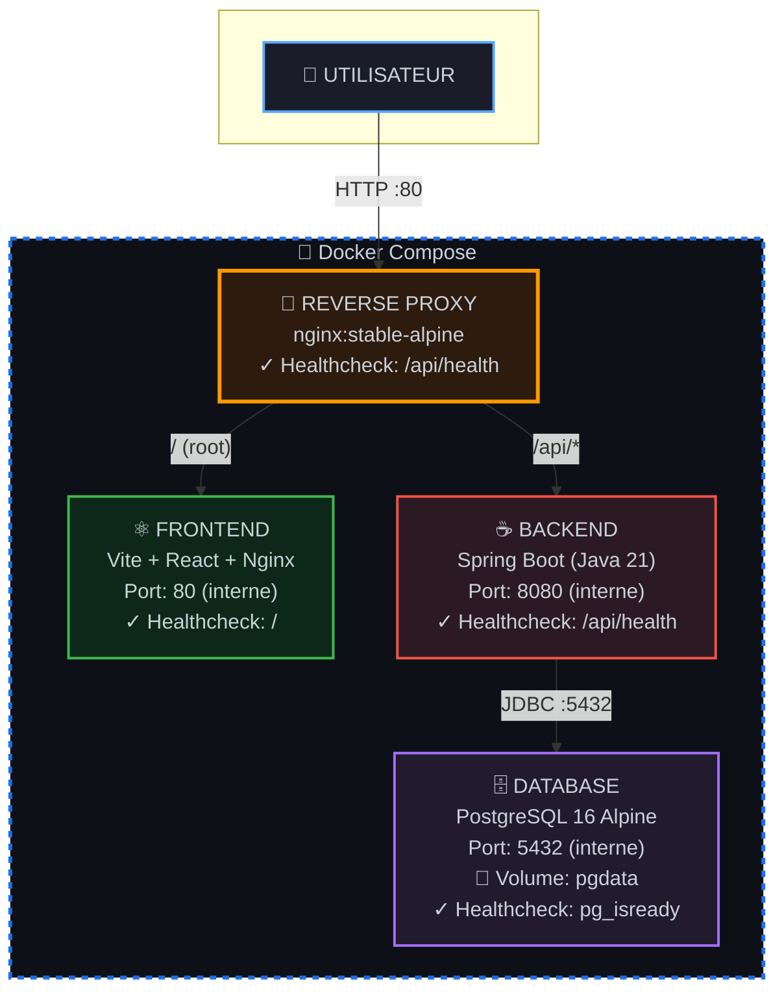

# Projet Final - Stack Spring Boot / Frontend JS / PostgreSQL

Projet réalisé par Valentin Russeil et Mattéo Pereira.

## Objectif du projet final

Assembler et exécuter une **application web complète** composée de trois services :

-   **Backend :** API REST Spring Boot
-   **Frontend :** application React ou Vue
-   **Base de données :** PostgreSQL
-   **Backend :** API REST Spring Boot
-   **Frontend :** application React ou Vue
-   **Base de données :** PostgreSQL

L’objectif est de conteneuriser chaque service, les orchestrer avec **Docker Compose**, et garantir la persistance des
données ainsi que la bonne communication entre les services. L’objectif est de conteneuriser chaque service, les
orchestrer avec **Docker Compose**, et garantir la persistance des données ainsi que la bonne communication entre les
services.

---

## Architecture Globale



**Légende** :

-   🔀 **Reverse Proxy** : Point d'entrée unique (port 80)
-   ⚛️ **Frontend** : Interface utilisateur React
-   ☕ **Backend** : API REST Spring Boot
-   🗄️ **Database** : Base de données PostgreSQL avec persistance
-   ✓ Tous les services ont des healthchecks
-   🐳 Tous les services communiquent via le réseau Docker Bridge

### Description des services

-   **API (Backend)**: `spring-api` — application Spring Boot (Java 21) qui fournit une API REST pour gérer les
    ressources (`Item`). Elle est construite avec un `Dockerfile` multi-stage et écoute sur le port `8080` (accessible
    uniquement via le réseau Docker interne). Dispose d'un healthcheck sur `/api/health`. Restart policy:
    `unless-stopped`.
-   **Frontend (Web)**: `webapp` — application JavaScript (Vite + React) qui est buildée puis servie par Nginx.
    Accessible uniquement via le reverse-proxy. Dispose d'un healthcheck. Restart policy: `unless-stopped`.
-   **Reverse Proxy**: `reverse-proxy` — Nginx qui expose le port `80` sur l'hôte et route `/` vers le frontend et
    `/api/` vers le backend. C'est le seul point d'entrée public. Dispose d'un healthcheck. Restart policy: `always`.
-   **Base de données (PostgreSQL)**: service `db` (PostgreSQL 16 Alpine) — stocke les données persistantes. Les données
    sont conservées via le volume Docker nommé `pgdata`. Dispose d'un healthcheck pour vérifier la disponibilité.
    Restart policy: `always`.

Commande pour démarrer le projet :

```
docker compose up -d
```

Pour tester :

-   Frontend : `http://localhost/`
-   Backend (via proxy) : `http://localhost/api/`

Autres informations :

-   Fichier `.env` pour les secrets (mot de passe DB, utilisateurs) à créer en se basant sur le `.env.example`.
-   Utilisation d'un réseau Bridge Docker par défaut pour la communication entre services.
-   Tous les services disposent de healthchecks pour garantir leur bon démarrage.
-   Les dépendances entre services sont gérées via `depends_on` avec conditions `service_healthy`.
-   Le reverse proxy gère les en-têtes CORS et les requêtes preflight OPTIONS.
-   **Restart policies** : `always` pour la DB et le reverse-proxy, `unless-stopped` pour l'API et le frontend.
-   Un fichier `docker-compose.override.yml` est disponible pour le développement local (voir section dédiée).

---

## Choix Techniques

### 🏗️ Architecture et Infrastructure

#### **Multi-stage Dockerfiles**

Nous avons opté pour des Dockerfiles multi-stage pour optimiser la taille des images finales :

-   **Backend (Spring Boot)** : Compilation avec Maven dans un premier stage, puis copie du JAR dans une image JRE minimale
-   **Frontend (React)** : Build de l'application Vite dans un stage Node.js, puis déploiement dans Nginx Alpine
-   **Avantages** : Images de production légères, temps de build optimisés, séparation claire entre environnement de build et runtime

#### **Images Alpine Linux**

Choix d'images basées sur Alpine (PostgreSQL 16 Alpine, Nginx Alpine) pour :

-   Réduire la surface d'attaque (sécurité)
-   Minimiser l'empreinte mémoire et disque
-   Accélérer les temps de pull et déploiement

#### **Reverse Proxy Nginx**

Implémentation d'un reverse proxy pour :

-   Centraliser le point d'entrée (Single Point of Entry)
-   Gérer le routage intelligent : `/` → frontend, `/api/*` → backend
-   Gérer les en-têtes CORS et les requêtes preflight OPTIONS
-   Simplifier la configuration SSL/TLS en production (un seul certificat)
-   Isoler les services internes du réseau public

### 🔄 Orchestration Docker Compose

#### **Healthchecks**

Tous les services disposent de healthchecks personnalisés :

-   **Database** : `pg_isready` pour vérifier la disponibilité PostgreSQL
-   **Backend** : Requête HTTP sur `/api/health`
-   **Frontend & Reverse Proxy** : Vérification de disponibilité HTTP
-   **Bénéfice** : Démarrage ordonné et fiable des services, détection précoce des problèmes

#### **Depends_on avec conditions**

Utilisation de `depends_on` avec `condition: service_healthy` pour :

-   Garantir que la DB est prête avant le démarrage du backend
-   Attendre que le backend et frontend soient opérationnels avant le reverse proxy
-   Éviter les erreurs de connexion au démarrage

#### **Restart Policies**

Stratégie de redémarrage différenciée :

-   **Database & Reverse Proxy** : `always` (services critiques, doivent toujours être disponibles)
-   **Backend & Frontend** : `unless-stopped` (permet l'arrêt manuel pour maintenance)

### 🛠️ Développement vs Production

#### **docker-compose.override.yml**

Séparation claire entre environnements :

-   **Développement** : Ports exposés, hot-reload, debugging activé, reverse proxy optionnel
-   **Production** : Services isolés, accès uniquement via reverse proxy, optimisation des ressources
-   **Avantage** : Flexibilité maximale sans duplication de configuration

#### **Profiles Docker Compose**

Le reverse proxy utilise un profil `with-proxy` en mode dev pour :

-   Permettre l'accès direct aux services pendant le développement
-   Activer le reverse proxy uniquement quand nécessaire pour tester le comportement production

### 🔐 Sécurité

#### **Variables d'environnement et fichier .env**

-   Externalisation des secrets (credentials DB)
-   Fichier `.env.example` comme template
-   Jamais de commit des secrets dans le repository

#### **Réseau Bridge isolé**

-   Communication inter-services via noms de services DNS internes
-   Aucun port exposé directement en production (sauf reverse proxy)
-   Isolation réseau des services sensibles (DB, API)

### 📦 Persistance des Données

#### **Volume Docker nommé**

Utilisation du volume `pgdata` pour PostgreSQL :

-   Persistance des données entre redémarrages et mises à jour
-   Isolation des données du système hôte
-   Facilite les backups et migrations

---

## Mode Développement (docker-compose.override.yml)

Le fichier `docker-compose.override.yml` permet de modifier le comportement de la stack pour le développement local. Il est automatiquement fusionné avec `docker-compose.yml` lors de l'exécution de `docker compose up`.

### Modifications apportées en mode dev :

-   **Backend (spring-api)** :

    -   Port `8080` exposé directement sur l'hôte (accessible via `http://localhost:8080`)
    -   Variable d'environnement `SPRING_PROFILES_ACTIVE=dev` activée
    -   Permet le debugging et le hot-reload

-   **Frontend (webapp)** :

    -   Utilise le stage `dev` du Dockerfile multi-stage
    -   Commande `npm run dev -- --host` pour lancer Vite en mode développement
    -   Port `5173` exposé sur l'hôte (accessible via `http://localhost:5173`)
    -   Hot Module Replacement (HMR) activé pour le développement React

-   **Reverse Proxy** :
    -   Désactivé par défaut via le profile `with-proxy`
    -   Pour l'activer : `docker compose --profile with-proxy up -d`
    -   En mode dev, l'accès direct aux services est privilégié

### Commandes en mode développement :

```bash
# Lancer la stack en mode dev avec le reverse-proxy
docker compose --profile with-proxy up -d

# Accès direct aux services en mode dev
# Frontend: http://localhost:5173
# Backend: http://localhost:8080
# Reverse Proxy (si activé): http://localhost:80
```

> **Note** : En mode développement, les services sont accessibles directement, ce qui facilite le debugging. En production, utilisez uniquement le `docker-compose.yml` sans override.

---

## Commandes pour builder et lancer

-   Construire et démarrer la stack :

```bash
docker compose up -d --build
```

-   Rebuilder les images :

```bash
docker compose build
```

-   Lancer les services :

```bash
docker compose up -d
```

-   Redémarrer les services (sans rebuild) :

```bash
docker compose restart
```

-   Couper les services (conserve les volumes) :

```bash
docker compose down
```

-   Couper et supprimer les volumes (⚠️ perte des données DB) :

```bash
docker compose down -v
```

-   S'assurer que le serveur est bien lancé avec :

```bash
docker logs -f tp-spring-api-1
```

Veillez à bien attendre que la base de données affiche son contenu avant de tester si tout fonctionne.

## Endpoints API et URLs

-   Frontend : `http://localhost/` (reverse-proxy sur port 80)
-   Backend (base URL proxied) : `http://localhost/api/` (via reverse-proxy)

Endpoints implémentés dans l'API :

-   `GET /api/health` — vérifie l'état de l'API (retourne `{ "status": "ok" }`).
-   `GET /api/items` — récupère la liste de tous les items.
-   `POST /api/items` — crée un nouvel item (corps JSON avec les champs de `Item`).

**Important** : Le frontend utilise des URLs relatives (`/api/...`) pour appeler l'API, ce qui garantit que toutes les
requêtes passent par le reverse-proxy. Les contrôleurs Spring n'exposent plus `@CrossOrigin` ; le reverse-proxy gère les
en-têtes CORS et les requêtes preflight OPTIONS.

## Problèmes rencontrés et solutions

Voici les problèmes que nous avons pu rencontrer et les solutions que nous avons trouvées :

-   Nous avons découvert le reverse proxy et avons mis un peu de temps à comprendre comme ça marchait réellement
-   Nous avons vu que la connexion entre le front et back n'était pas présente. La solution se trouvait dans le fait
    d'avoir le reverse proxy qui fonctionne mieux et notre docker compose qui ne gere pas les ports vu que seul le
    reverse proxy agit dessus.
-   Nous avons eu quelques difficultés avec le docker-compose.override.

## Tâches réalisées

✅ 1. Écriture des `Dockerfile` pour le backend (multi-stage) et le frontend (build + Nginx). - Chaque dossier contient
son propre `Dockerfile`.

✅ 2. Création du fichier `.env` pour les secrets (à créer à partir du `.env.example`).

✅ 3. Écriture du `docker-compose.yml` complet (API, Web, DB, Reverse Proxy).

✅ 4. Tests de bon fonctionnement de la stack : - API accessible via le reverse-proxy : `http://localhost/api/` -
Frontend sur `http://localhost/` (reverse-proxy) - Persistance PostgreSQL via volume.

✅ 5. Documentation claire et précise rédigée.

---

## Tests et validation

<p></p>

1️⃣ Lancer la stack :

```bash
docker compose up -d --build
```

2️⃣ Vérifier que tout fonctionne :

-   Frontend disponible sur [http://localhost/](http://localhost/)
-   API accessible via le proxy : [http://localhost/api/health](http://localhost/api/health)
-   PostgreSQL persistant via le volume `pgdata`

## Bonus réalisés

✅ **Reverse proxy Nginx** : Implémenté avec succès pour gérer le routage entre le frontend (`/`) et le backend
(`/api/`). Le reverse proxy gère également les en-têtes CORS et les requêtes OPTIONS.

✅ **Healthchecks** : Tous les services disposent de healthchecks pour garantir leur disponibilité avant que les
services dépendants ne démarrent.

✅ **Configuration optimisée** : Utilisation de `depends_on` avec conditions `service_healthy` pour orchestrer le
démarrage des services dans le bon ordre.
